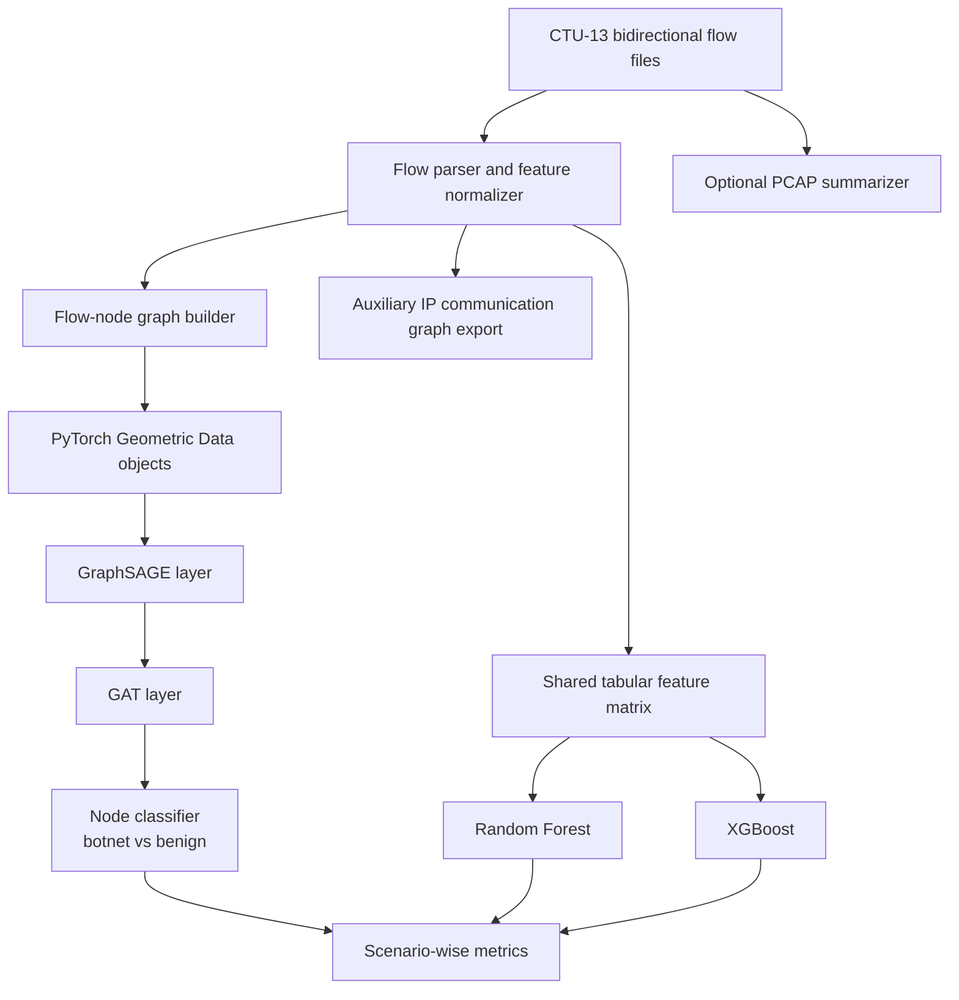

# GNN-Based Botnet Traffic Detection on CTU-13 (GBD-CTU)

GBD-CTU is a research-oriented repository for botnet traffic detection on the CTU-13 benchmark. The project treats CTU-13 bidirectional flows as the canonical event representation, projects communication structure into a graph, and evaluates a hybrid GraphSAGE + GAT node classifier against classical tree-based baselines.

## Motivation

Botnet detection from network telemetry is usually framed as a tabular classification problem, but botnet behavior is relational by construction: infected hosts fan out to command-and-control endpoints, share infrastructure, repeat communication patterns, and create temporal neighborhoods that do not appear in isolated flow vectors. A graph formulation allows the model to reason jointly over local feature content and shared communication context. In CTU-13, this matters because botnet, normal, and background activity coexist inside the same scenario, so relational cues can help separate malicious flows that would otherwise look superficially benign.

## Dataset Description

CTU-13 is a labeled botnet traffic benchmark composed of 13 scenarios collected at CTU University in 2011. Each scenario mixes botnet traffic with normal user activity and background traffic. The dataset provides labeled bidirectional NetFlow-style summaries and botnet PCAP captures for scenario-level analysis. This repository uses the labeled bidirectional flow files as the main training signal and optionally supports PCAP summarization for exploratory augmentation.

- 13 botnet scenarios with different malware families and behavior profiles
- Mixed traffic composition: botnet, normal, and background
- Scenario-wise reporting to expose cross-scenario robustness instead of a single pooled score
- Binary node labels in this repository: botnet vs. benign, where benign folds normal and background traffic together

## System Architecture



## Graph Construction Methodology

The repository keeps two graph views because they serve different purposes.

The exported communication graph is an IP-level directed graph where nodes are IP addresses and edges are aggregated flows weighted by packet, byte, and flow counts. This graph is useful for topology inspection and for explaining host-level communication structure.

The training graph is a line-graph-inspired flow graph where each bidirectional flow is a node. Two flow nodes are connected when they share a source IP, share a destination IP, or belong to the same unordered IP pair. This preserves the user-specified node-classification objective while still grounding connectivity in IP-level communication structure. Edge attributes store a simple relation tag and temporal gap between neighboring flows.

Node features include duration, ports, packet counts, byte counts, protocol encoding, connection state encoding, direction encoding, source and destination IP factor codes, a subnet match indicator, and a well-known-port indicator.

## GNN Model Overview

The neural architecture is a hybrid GraphSAGE + GAT classifier.

- GraphSAGE performs the first neighborhood aggregation step and stabilizes feature propagation across heterogeneous neighborhoods.
- GAT then reweights the propagated neighborhood context with learned attention, which is useful when a host participates in both benign and malicious communication patterns.
- A linear head predicts node-level botnet probability.

This design keeps the model compact enough for scenario-wise experimentation while still giving it explicit relational capacity beyond a plain message-passing stack.

## Baseline Models

Two classical baselines are trained on the exact same node features and train/validation/test masks derived from the graph artifacts.

- XGBoost for a strong gradient-boosted tree benchmark
- Random Forest for a robust non-linear ensemble baseline

Using the same feature matrix and split logic keeps the comparison faithful: any performance gap is driven by the model family rather than by data leakage or feature mismatch.

## Repository Layout

```text
.
├── .github/workflows/ci.yml
├── configs/default.yaml
├── src/gbd_ctu/
├── tests/
├── CONTRIBUTING.md
├── LICENSE
├── Makefile
├── README.md
├── pyproject.toml
└── requirements.txt
```

## Installation

### Conda Environment

```bash
conda create -n gbd-ctu python=3.11 -y
conda activate gbd-ctu
python -m pip install --upgrade pip
python -m pip install torch==2.5.1 --index-url https://download.pytorch.org/whl/cpu
python -m pip install torch-scatter torch-sparse torch-geometric -f https://data.pyg.org/whl/torch-2.5.1+cpu.html
python -m pip install -r requirements.txt
python -m pip install -e .
```

### Pip-Only Alternative

```bash
python -m venv .venv
source .venv/bin/activate
python -m pip install --upgrade pip
python -m pip install torch==2.5.1 --index-url https://download.pytorch.org/whl/cpu
python -m pip install torch-scatter torch-sparse torch-geometric -f https://data.pyg.org/whl/torch-2.5.1+cpu.html
python -m pip install -r requirements.txt
python -m pip install -e .
```

## Usage

Place CTU-13 scenario flow files under `data/ctu13/` or point the CLI to another root.

### Build Graph Artifacts

```bash
make build-graphs
```

Equivalent CLI call:

```bash
python -m gbd_ctu build-graphs --data-root data/ctu13 --output-dir artifacts/graphs
```

### Train the GNN

```bash
make train
```

Equivalent CLI call:

```bash
python -m gbd_ctu train --graph-dir artifacts/graphs --checkpoint artifacts/checkpoints/gnn_model.pt --epochs 20
```

### Evaluate Scenario-Wise Performance

```bash
make evaluate
```

Equivalent CLI call:

```bash
python -m gbd_ctu evaluate --graph-dir artifacts/graphs --checkpoint artifacts/checkpoints/gnn_model.pt --output artifacts/reports/gnn_metrics.csv
```

### Train and Compare Baselines

```bash
make compare-baselines
```

Equivalent CLI call:

```bash
python -m gbd_ctu compare-baselines --graph-dir artifacts/graphs --report-dir artifacts/reports --gnn-report artifacts/reports/gnn_metrics.csv
```

### Generate Comparison Tables and Figures

```bash
python -m gbd_ctu.scripts.compare_models --results-dir artifacts/reports/ --output-dir artifacts/comparison/
```

Produces per-metric wide-format CSV tables, a Markdown summary, and figures:

| Figure | Description |
| --- | --- |
| [auc\_by\_scenario.png](artifacts/comparison/figures/auc_by_scenario.png) | Grouped bar chart — AUC per scenario by model |
| [f1\_by\_scenario.png](artifacts/comparison/figures/f1_by_scenario.png) | Grouped bar chart — F1 per scenario by model |
| [roc\_curves.png](artifacts/comparison/figures/roc_curves.png) | ROC curves for all models |

All figures are saved at 300 dpi (PNG) and vector quality (PDF) under `artifacts/comparison/figures/`.

## Results Table

The table below is initialized for complete scenario-wise reporting and is meant to be overwritten by reproducible experiment outputs from `artifacts/reports/comparison.csv`.

| Scenario | GNN AUC | GNN F1 | XGBoost AUC | XGBoost F1 | Random Forest AUC | Random Forest F1 | Status |
| --- | --- | --- | --- | --- | --- | --- | --- |
| 1 | pending | pending | pending | pending | pending | pending | Awaiting experiment run |
| 2 | pending | pending | pending | pending | pending | pending | Awaiting experiment run |
| 3 | pending | pending | pending | pending | pending | pending | Awaiting experiment run |
| 4 | pending | pending | pending | pending | pending | pending | Awaiting experiment run |
| 5 | pending | pending | pending | pending | pending | pending | Awaiting experiment run |
| 6 | pending | pending | pending | pending | pending | pending | Awaiting experiment run |
| 7 | pending | pending | pending | pending | pending | pending | Awaiting experiment run |
| 8 | pending | pending | pending | pending | pending | pending | Awaiting experiment run |
| 9 | pending | pending | pending | pending | pending | pending | Awaiting experiment run |
| 10 | pending | pending | pending | pending | pending | pending | Awaiting experiment run |
| 11 | pending | pending | pending | pending | pending | pending | Awaiting experiment run |
| 12 | pending | pending | pending | pending | pending | pending | Awaiting experiment run |
| 13 | pending | pending | pending | pending | pending | pending | Awaiting experiment run |

## Citation

If you use CTU-13 in academic work, cite the original dataset paper:

```bibtex
@article{garcia2014empirical,
  title   = {An empirical comparison of botnet detection methods},
  author  = {Garcia, Sebastian and Grill, Martin and Stiborek, Jan and Zunino, Alejandro},
  journal = {Computers \& Security},
  volume  = {45},
  pages   = {100--123},
  year    = {2014},
  doi     = {10.1016/j.cose.2014.05.011}
}
```

## License

This project is released under the MIT License. See `LICENSE` for the full text.
